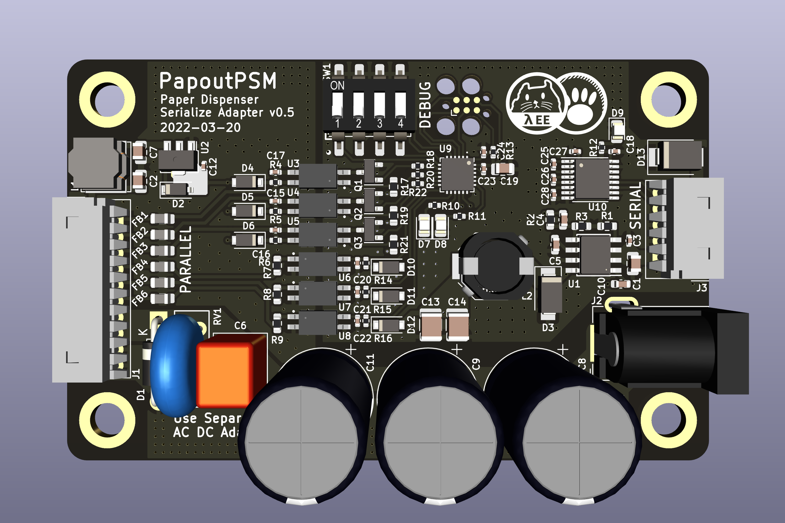
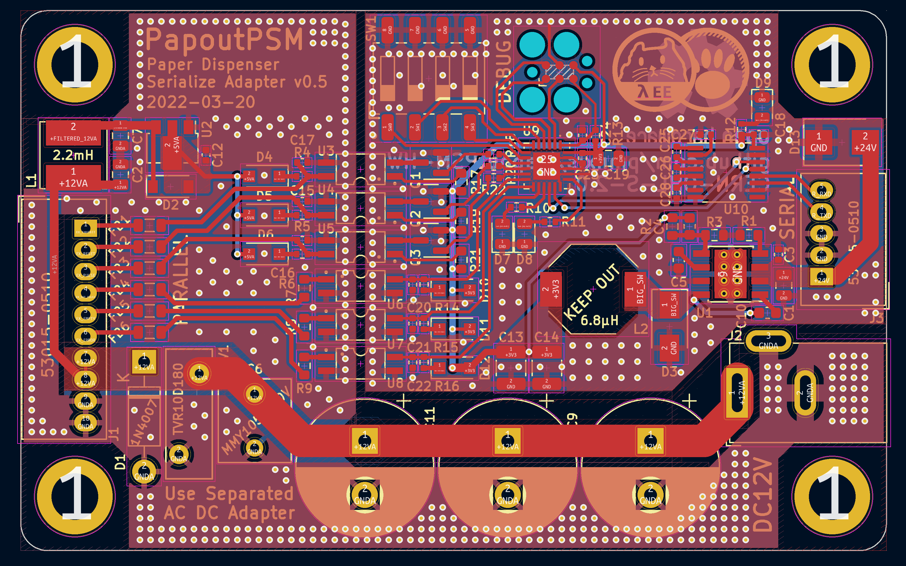

# PapoutPSM-HW

| 3D Model | Real Image |
| -------- | ---------- |
|  |  |

Parallel to Serial Adapter for Korean Paper Dispenser Machine.
Some wellknown korean paper dispenser have two type of device.
Serial model communicate to host with RS232.

## PCB Specification
- DRC/Fabrication Clearance : JLCPCB Standard 2 Layer Spec.
- PCB : 2Layer FR4 ; 1.6T , Considerd on black colour.
- Size : 80mm * 50mm

## Power Connection
### 12V Usage (Normal)
- Connect Secondary Power Source (ACDC Adapter) 12VDC (5A) to barral jack.
- Use default varistor (RV1). Default is `10Ø 18V`.

### 24V Usage
- Connect Secondary Power Source (ACDC Adapter) 24VDC (3A) to barral jack.
- Use custom varistor (RV1). Must be higher or eqeual with `30V`.

### Programming
- MSP430FR2433 with CCStudio.
- or with Rust? https://github.com/rust-embedded/msp430-quickstart
- Emulating dispenser machine should count exhaust or some configuration on non violent storage. MSP43FR have internal FeRAM. Thus ensure high durability on many write operation.

### Related Project 
https://github.com/pmnxis/papout-psm-rs